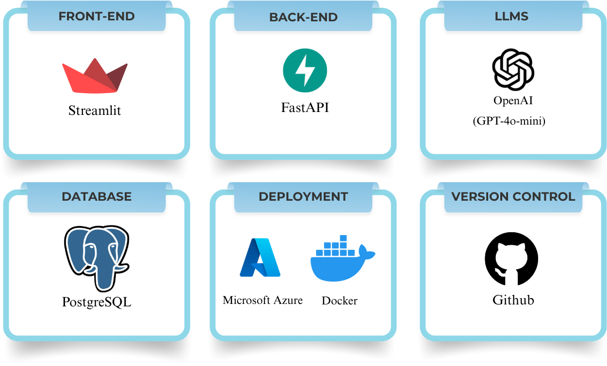

---

# 🎓 EduMentor AI – Intelligent Tutoring & Learning Assistant

EduMentor AI is an **all-in-one intelligent tutoring and educational assistant** that helps students learn in a more **personalized, interactive, and effective** way.

It can:

* Summarize content
* Generate flashcards
* Discover learning resources
* Check grammar
* Generate and grade quizzes
* Track progress
* Review job-related technical skills

The goal is to make **personalized learning simple and accessible** for everyone.

---

## 💡The Technology Behind EduMentor AI


---

## 🌟 How EduMentor AI Works ?

| Action | Description |
|-------|-------------|
| **User Inputs Content or Question** | The student enters text, uploads material, then selects a task (summarize, quiz, etc.). |
| **System Processes the Request** | The platform analyzes the input and identifies the required learning support type. |
| **AI Model Generates Output** | The AI model produces the needed result (summary, flashcards, quiz, etc.). |
| **Result is Displayed to the User** | The generated content is shown in an organized and easy-to-understand format. |
| **Feedback & Progress Tracking** | Performance data is stored and used to guide future learning recommendations. |

---

## ⚙️ Project Structure

High-level layout:

```text
project/
├── deployment/
│   ├── .env                ← contains DB vars & API keys (created locally by you)
│   ├── compose.yml         ← Docker Compose file (backend + frontend + DB)
│   ├── api.Dockerfile      ← Dockerfile for FastAPI backend
│   └── ui.Dockerfile       ← Dockerfile for Streamlit frontend
└── app/
    ├── backend/
    │   └── main.py         ← FastAPI backend app
    ├── frontend.py         ← Streamlit frontend app
    └── requirements.txt    ← Python dependencies
```

In the original description:

* `app/backend/main.py` – FastAPI backend code
* `app/frontend.py` – Streamlit frontend code
* `.github/workflows/deploy.yml` – GitHub Actions for CI/CD
* `app/requirements.txt` – Project dependencies
* `README.md` – Project documentation

---

# 🧰 Part 1 – Running EduMentor AI Locally with Docker

This section assumes you want to run everything on **your own computer** (local machine).

### ✅ 1. Prerequisites

Please install the following:

1. **Git**

   * Download from the official Git website or use your OS package manager.

2. **Docker**

   * **Windows / macOS**: Install **Docker Desktop**.
   * **Linux (Ubuntu)**: Docker Engine + Docker Compose plugin (see below for commands in the VM section).

3. **WSL (Windows only)**
   If you are on Windows, enable **WSL2** (Windows Subsystem for Linux).

   * Open **PowerShell as Administrator** and run:

     ```powershell
     wsl --install
     ```
   * Restart your computer if asked.
   * Install **Ubuntu** from the Microsoft Store (recommended).

4. **(Optional but recommended)** Python 3.10+
   This is not required for Docker, but useful if you want to run or inspect Python code directly.

---

### 📥 2. Clone the Repository

Open a terminal (PowerShell / cmd / WSL / macOS Terminal / Linux terminal) and run:

```bash
git clone https://github.com/OnlyGhassan/EduMentor-AI.git
cd EduMentor-AI
```

Now you are inside the project root folder: `EduMentor-AI`.

---

### 🧪 3. (Optional) Create a Local Python Virtual Environment

This is optional for Docker, but helpful if you want to inspect or run the app code manually.

From the **project root** (`EduMentor-AI`):

```bash
python -m venv .venv
```

Activate it:

* **Windows (PowerShell)**:

  ```bash
  .venv\Scripts\Activate
  ```
* **macOS / Linux / WSL**:

  ```bash
  source .venv/bin/activate
  ```

Install Python dependencies:

```bash
cd app
pip install -r requirements.txt
cd ..
```

You can deactivate later (after finshing) with:

```bash
deactivate
```

---

### 🔐 4. Create the `.env` File (VERY IMPORTANT)

The project uses environment variables for:

* Database connection
* API keys (OpenAI)
* JWT secrets
* CORS configuration

> **Important:** The `.env` file is **not** in GitHub for security reasons.
> You need to **create it yourself** on your machine.

Create the file at:

```text
EduMentor-AI/deployment/.env
```

#### 🔹 If you’re on Windows:

1. In File Explorer, navigate to `EduMentor-AI/deployment`.
2. Right-click → **New** → **Text Document**.
3. Name it: `.env`  (make sure it is not `.env.txt`).
4. Open it with **Notepad** and paste the following:

#### 🔹 If you’re on macOS / Linux / WSL:

```bash
cd EduMentor-AI/deployment
touch .env
nano .env
```

Then paste this content inside `.env`:

```env
# copy to .env and edit:
ENV=dev

# Put your own OpenAI API key value here (no spaces)
OPENAI_API_KEY="YOUR_OPENAI_API_KEY_HERE"

APP_DB_HOST=db
APP_DB_PORT=5432
APP_DB_NAME=edumentor
APP_DB_USER=edumentor
APP_DB_PASSWORD=edumentorpw

# JWT
JWT_SECRET=super-secret-change-me
JWT_ALG=HS256
ACCESS_TOKEN_EXPIRE_MINUTES=1440

# CORS origins (comma-separated)
CORS_ORIGINS="http://localhost:8501,http://127.0.0.1:8501,http://172.24.124.9:8501,http://0.0.0.0:8501"
```

Then:

* Replace `YOUR_OPENAI_API_KEY_HERE` with your actual **OpenAI API key**.
* On **nano**, press:

  * `Ctrl + O` → Enter (to save)
  * `Ctrl + X` (to exit)

---

### 🐳 5. Run the Project with Docker Compose (Locally)

From the project root (`EduMentor-AI`), go to the `deployment` folder:

```bash
cd deployment
```

Now run:

```bash
docker compose -f compose.yml --env-file .env up -d --build
```

Explanation:

* `docker compose` – uses Docker Compose v2 (built into Docker Desktop / plugin).
* `-f compose.yml` – tells Docker which compose file to use.
* `--env-file .env` – loads environment variables from the `.env` file you created.
* `up` – starts the containers.
* `-d` – runs them in the background (detached).
* `--build` – builds images before starting containers.

To verify containers are running:

```bash
docker compose ps
```

You should see containers for:

* Backend API (FastAPI)
* Frontend UI (Streamlit)
* Database (PostgreSQL)

---

### 🌐 6. Open EduMentor AI in Your Browser

Once Docker is running successfully, open:

```text
http://localhost:8501
```

This should load the **EduMentor AI web interface**.

If it doesn’t load:

* Wait a few seconds and refresh the page.
* Check containers:

  ```bash
  docker compose logs
  ```
* Make sure your `.env` file is correct and Docker is running.

---

### 🛑 7. Stopping the Project Locally

When you’re done testing:

From `EduMentor-AI/deployment`:

```bash
docker compose -f compose.yml down
```

This stops and removes the containers.

---

# ☁️ Part 2 – Deploying EduMentor AI on a Cloud VM (Azure / AWS)

This section explains how to deploy the app on a **virtual machine** (Ubuntu), e.g., **Azure VM** or **AWS EC2**.

## 🧱 1. Prepare Your Own GitHub Repository

1. First, clone the original repo locally (if you haven’t already):

   ```bash
   git clone https://github.com/OnlyGhassan/EduMentor-AI.git
   cd EduMentor-AI
   ```

2. Create a **new empty repository** on your own GitHub account (e.g., `my-edumentor-ai`).

3. Add it as a remote and push:

   ```bash
   git remote remove origin
   git remote add origin https://github.com/<your-username>/<your-repo>.git
   git branch -M main
   git push -u origin main
   ```

This makes your GitHub repository the source for deployment.

---

## 🖥️ 2. Create a VM (Ubuntu)

On Azure / AWS:

1. Create a **Virtual Machine** with:

   * **OS**: Ubuntu (e.g., 22.04 LTS)
   * Size: smallest standard is OK for testing (e.g., B1s).

2. Open these **inbound ports** in the VM’s network / security settings:

   * **22** – for SSH
   * **5000** – backend API (FastAPI) port
   * **8501** – frontend (Streamlit) port

3. Download the **SSH key file** (e.g., `EduMentorAI_key.pem`).

4. On your local machine, in the folder where `EduMentorAI_key.pem` is saved, run:

   ```bash
   chmod 600 EduMentorAI_key.pem
   ```

This protects the key so SSH accepts it.

---

## 🔑 3. Add GitHub Actions Secrets (For CI/CD Deployment)

In your **GitHub repo** (the one you just pushed):

1. Go to:
   `Settings` → `Secrets and variables` → `Actions` → **Secrets** tab → **New repository secret**

2. Add three secrets:

### 🔹 Secret 1: `VM_SSH_KEY`

* **Name**: `VM_SSH_KEY`
* **Value**:

  * Open the key file locally:

    ```bash
    cat EduMentorAI_key.pem
    ```
  * Copy the entire content and paste it into the secret value box.

### 🔹 Secret 2: `VM_USER`

* **Name**: `VM_USER`
* **Value**: your VM username (e.g., `azureuser`)

### 🔹 Secret 3: `VM_HOST`

* **Name**: `VM_HOST`
* **Value**: your VM public IP (e.g., `20.81.211.89`)

These secrets will be used by `.github/workflows/deploy.yml` for automatic deployment (if set up).

---

## 🔌 4. SSH into the VM

From your local terminal in the directory containing `EduMentorAI_key.pem`:

```bash
ssh -i EduMentorAI_key.pem azureuser@20.81.211.89
```

Replace:

* `azureuser` → your real VM username
* `20.81.211.89` → your VM public IP

Now you should be **inside the VM**.

---

## 📥 5. Clone Your Repo Inside the VM

Inside the VM terminal:

```bash
git clone https://github.com/<your-username>/<your-repo>.git
cd <your-repo>
```

Example:

```bash
git clone https://github.com/myname/my-edumentor-ai.git
cd my-edumentor-ai
```

---

## 🔐 6. Create the `.env` File on the VM

Go to the `deployment` folder:

```bash
cd deployment
```

Create and edit `.env`:

```bash
touch .env
vim .env
```

Inside `vim`:

1. Press `i` to enter **insert mode**.

2. Paste the same `.env` content you used locally:

   ```env
   ENV=dev
   OPENAI_API_KEY="YOUR_OPENAI_API_KEY_HERE"

   APP_DB_HOST=db
   APP_DB_PORT=5432
   APP_DB_NAME=edumentor
   APP_DB_USER=edumentor
   APP_DB_PASSWORD=edumentorpw

   JWT_SECRET=super-secret-change-me
   JWT_ALG=HS256
   ACCESS_TOKEN_EXPIRE_MINUTES=1440

   CORS_ORIGINS="http://localhost:8501,http://127.0.0.1:8501,http://172.24.124.9:8501,http://0.0.0.0:8501"
   ```

3. When done, press:

   * `Esc`
   * Type `:wq`
   * Press `Enter`
     This saves and exits `vim`.

---

## 🧪 7. Setup Python Environment on the VM (Optional)

Still inside the repo (e.g., `/home/azureuser/my-edumentor-ai`):

```bash
sudo apt update
sudo apt install python3-venv -y
python3 -m venv .venv
source .venv/bin/activate
```

(You don’t **have** to use this venv for Docker, but it’s useful for testing Python code directly.)

---

## 🐳 8. Install Docker & Docker Compose on Ubuntu VM

Just in case there is an old Docker version:

```bash
sudo apt remove docker docker-engine docker.io containerd runc -y
```

Then install Docker properly:

```bash
sudo apt update
sudo apt install ca-certificates curl gnupg -y
sudo install -m 0755 -d /etc/apt/keyrings
curl -fsSL https://download.docker.com/linux/ubuntu/gpg | sudo gpg --dearmor -o /etc/apt/keyrings/docker.gpg
sudo chmod a+r /etc/apt/keyrings/docker.gpg
echo \
  "deb [arch=$(dpkg --print-architecture) signed-by=/etc/apt/keyrings/docker.gpg] \
  https://download.docker.com/linux/ubuntu noble stable" | \
  sudo tee /etc/apt/sources.list.d/docker.list > /dev/null

sudo apt update
sudo apt install docker-ce docker-ce-cli containerd.io docker-buildx-plugin docker-compose-plugin -y
```

Check that Docker Compose works:

```bash
docker compose version
```

You should see some version info, not an error.

Give your user permission to run Docker without `sudo`:

```bash
sudo usermod -aG docker $USER
newgrp docker
```

---

## 🚀 9. Run EduMentor AI on the VM with Docker

From inside the `deployment` folder on the VM:

```bash
docker compose -f compose.yml --env-file .env up -d --build
```

This will:

* Build the backend, frontend, and DB images.
* Start all containers in the background.

You can check their status:

```bash
docker compose ps
```

---

## 🌍 10. Access EduMentor AI from Your Browser

On **your local machine**, open your browser and go to:

```text
http://<VM_PUBLIC_IP>:8501
```

Example:

```text
http://20.81.211.89:8501
```

You should now see the **EduMentor AI web app**, live on your VM.

---

## 🧹 11. Stopping the App on the VM

To stop the app and containers:

```bash
cd /path/to/your/repo/deployment
docker compose -f compose.yml down
```

---

## ✅ Summary

You now know how to:

* Run **EduMentor AI locally** using Docker and Docker Compose.
* Create and configure the required **.env** file.
* Deploy EduMentor AI to a **cloud VM (Azure/AWS)** using SSH, Docker, and environment variables.

This should be enough for someone starting from scratch to **clone, configure, run, and experiment** with EduMentor AI both locally and in the cloud.

